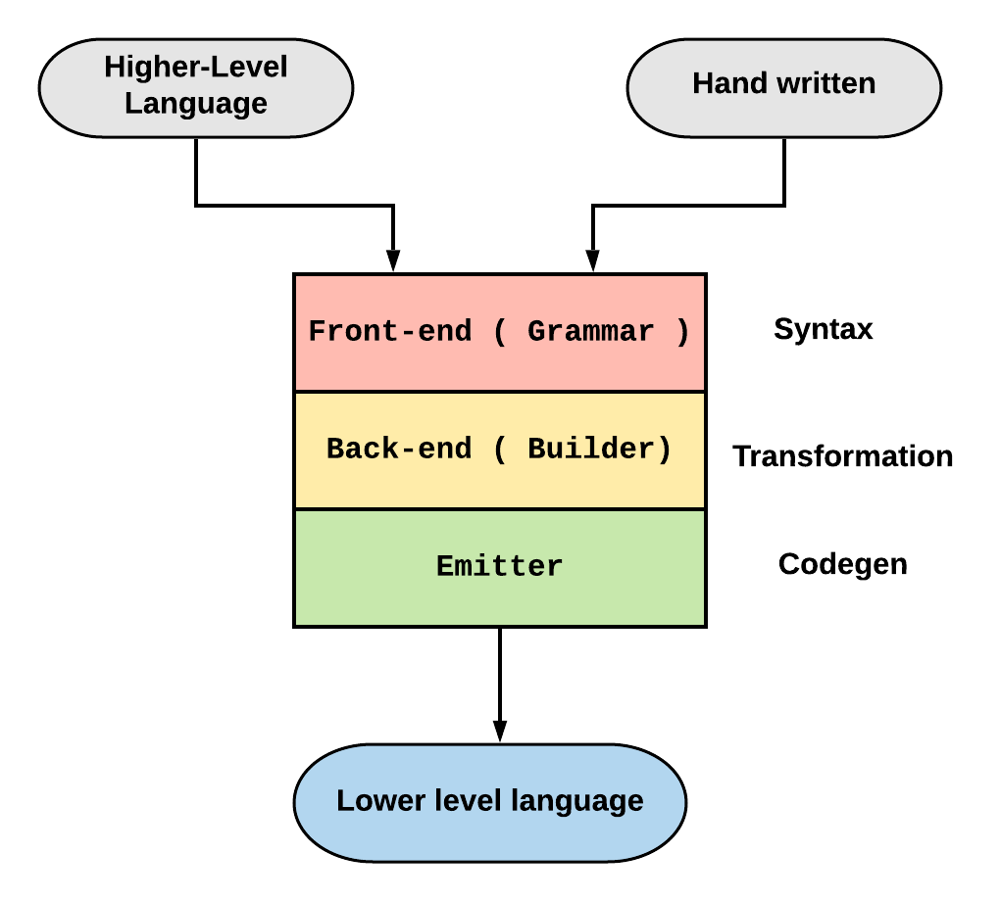

# Chisel3 Backend Learning

In this repository, I explained my journey in learning how does Chisel3 work.
Chisel3 implementation currently in computer architecture community is one of the well-defined open source hardware languages.
My motivation to start learning Chisel3 backend is how can I write my own hardware DSL in Chisel/Scala without reinventing wheels and use Chisel developers experiences to come up with a generate frame work to develop hardware DSLs.
Currently, my goal is to come up with a general framework to develop new hardware IR/Languages.
Right now we are in post-moore area in computer architecture.
This year, 2019, there was a visioning workshop at ISCA 2019 explaining the road map for computer architects.
The interesting point about the talks was that, everyone were agreed to the point that we are in golden period of time. And most of the talks were around **Agile Hardware**.
But the question is that, how much are we ready for this period of time.
Fortunately, from 2010 Berkeley university started focusing on developing open source tools for hardware design. RISC-V, Chisel, FIRRTL and etc. Are only examples of such widespread projects.
Delite, Spatial and Plastecine are another example of such full-stack projects. Currently, there is another project from Standford University *CoreIR* which focuses and formalizing hardware design.
I like to categorized my recent work in this field, *µIR* as another example of such practices.

One of the big flaws that I can see in most of such tools is lack of a general framework and pathway description for other groups to explain how did they developed their tools and how good is their **Software Engineering** effort.

For instance, there are other works in the software community that they are using a common methodology to develop their new DSLs/Languages like Halide or TensorCompiler.
My view at this point is that maybe learning computer architecture and different techniques to come up with a single golden design is not something to help **Agile Hardware** design and what we really need at this moment is a set of tutorials and well documented tools to describe how someone can implement his new architect idea as a new language and plug it into other existing frameworks.

For instance, one of the challenges that I had, and still is not completely solved, is how to formalize my memory design in µIR.
µIR has first class support for memory modules and designs. However, memory representation in the language can be limited and there are many space for improvement. However, this improvement is independent from the rest of the system.
What I'm thinking right now, is developing a septate µIR-Mem language to just express memory modules, optimize and synthesize a new design.
The same idea can be applied to **Debugging** framework. I need to have a formalize way to express debug elements in my design.
However, adding and optimizing such debug elements are independent from the overall system design.

What I believe is that the first step to decouple all these different pieces from the main language is having a comprehensive framework to develop all these languages.

What I call as a language contains the following elements:

1. **Grammar - Front-end:** The first piece of any language is specification and grammar. The language itself can be autogenerated or hand-written but having a well-defined grammar is critical in both cases

2. **A parser and AST:** Any input language needs to be parsed and become an in memory graph. Any type of analysis and transformation/analysis needs such graph and API. Hence, this part is also common between all these langues.

3. **Emitter:** After optimizing and analyzing the input language is lower down the input language to another form so that the rest of the system can take care of the result.

With this view, I'm going to explain my journey in learning Chisel3 architecture with the hope of learning how to design a new DSL language and a common framework to build different DSLs.

[Start Learning Chisel](./Chisel/Intro.md)